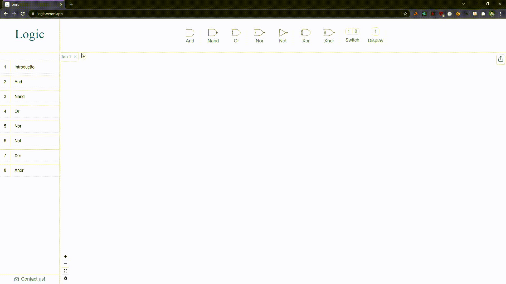

# Logic

Site para ensino e simulação de circuitos lógicos.

## Descrição

Este projeto foi desenvolvido com o intuido de facilitar o aprendizado sobre circuitos lógicos, nele é possível:

- Simular circuitos lógicos:



- Trabalhar em abas e compartilhar seus circuitos:


- Ler conteúdos sobre circuitos e portas lógicas:


## Principais Tecnologias

- [Next.js](https://nextjs.org)
- [React flow](https://reactflow.dev)
- [Styled components](https://styled-components.com)
- [MongoDB](https://www.mongodb.com/)
- [Prismic](https://prismic.io)
- [Vercel](https://vercel.com)

## Como Executar o projeto

O projeto está disponível na seguinte url: https://logic.vercel.app.
Mas caso queira executar na sua máquina, faça o seguinte:

***Requer node instalado**


- Clone o projeto e entre na pasta dele:
```bash
  # Clone o projeto
  git clone https://github.com/DanielSLucas/Logic.git

  # Entre na pasta do projeto
  cd Logic
```

- Crie um arquivo `.env.local` na raiz do projeto, com as informações abaixo:
```
  MONGODB_URI=
  NEXT_PUBLIC_URL=
```

- Instale as dependências do projeto e o execute:
```bash
  # Instale as dependências
  yarn # ou npm i

  # Execute o projeto
  yarn dev # ou npm run dev
```
